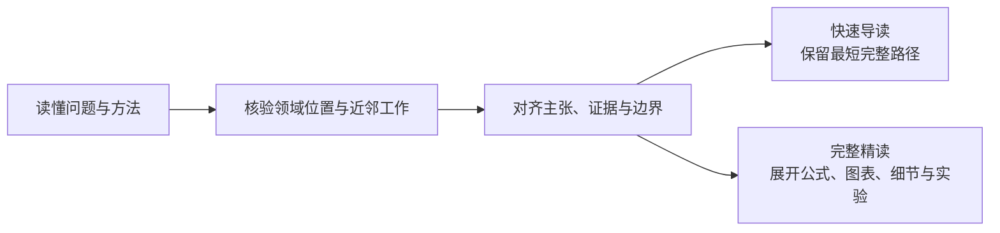

# 祛魅阅读 Skills

**简体中文** | [English](README_EN.md)

[](LICENSE)
[](#安全与兼容性)

**先把问题和方法真正讲懂，再判断它到底新在哪里、证据撑到哪里。**

很多论文、综述和技术文章并不是内容本身无法理解，而是术语、叙事和结果展示混在一起：读者看见了一个复杂系统，却不容易分清难题是什么、能力从哪里来，以及实验究竟支持哪一层结论。

这两个 Skill 使用同一套“易懂 + 祛魅”读法，只改变最终展开的细度：



## 它帮你回答什么

- 这项工作解决什么问题，为什么困难？
- 方法到底怎样工作，关键能力来自哪里？
- 相比最接近的已有工作，真正新增了什么？
- 哪些实验支撑核心结论，哪些只能作为补充？
- 去掉宣传性表达后，它还剩下什么价值，适合怎样使用？

## 选择阅读深度

| | ⚡ `clear-eyed-reading` | 🔬 `clear-eyed-deep-reading` |
| --- | --- | --- |
| **适合** | 想快速读懂、判断创新与价值 | 想系统掌握方法，理解公式、图表、细节与实验 |
| **呈现** | 问题与背景 → 方法 → 真正新增 → 决定性证据 → 祛魅结论与五维评价 | 领域位置 → 问题 → 方法主线与贯穿例子 → 关键细节、公式和图表 → 实验 → 判断 |
| **结果** | 支撑判断的最短完整路径 | 足以复述、画出、复用并质疑方法的展开解读 |

两者对材料、来源和证据使用同一标准。快速导读不是少做核验，而是少展示不改变判断的细节；完整精读也不是更严苛地挑错，而是把理解和判断所需的链条展开。

两种读法都会实际核验与核心主张有关的原图；快速导读只展示会改变判断的图，完整精读则优先展开最关键的一至三张。公式按作用命名，并放回它参与的方法步骤。实验先围绕核心结论、创新和贡献解释决定性证据，再说明消融、扩展、鲁棒性、定性结果和失败案例补充了什么。复杂流程在确实有助于理解时配一张简洁 Mermaid 图；若界面不支持 Mermaid，则使用可直接阅读的纯文本流程，不堆砌图表。

对于完整研究论文，两种读法都从五个维度分别评价：**新颖性、严谨性、重要性、清晰度、可复现/可复核性**。它们不合成为一个看似精确的总分。

## 判断依据

- **先读懂，再评价。** 先重建问题、方法和一个贯穿例子，避免用术语替代解释。
- **独立定位增量。** 有检索能力时，从领域脉络、近邻工作和可能削弱创新主张的前例分别查证；Related Work 只作为线索。
- **不按篇数凑结论。** 会改变判断的候选需要回到原文逐项比较；研究在结论收敛且已知缺口能够说明时停止。
- **拆开能力来源。** 提示、标签、人工规则、外部模型、评测器和数据处理是否承担了关键难题，会被明确指出。
- **让结论与证据同尺度。** “系统表现更好”“某模块造成提升”“作者的解释成立”是三项不同主张。
- **只谈会改变结论的局限。** 指出哪项主张需要收窄，以及收窄后仍然成立的贡献，而不是罗列通用缺点。

环境支持子代理（subagent）时，领域脉络、近邻工作和反证先例可以隔离并行核验，由主 agent 统一阅读关键来源并成文；不支持时按同样的问题顺序执行，并说明独立性较弱。无法外部检索或材料不完整时，Skill 会相应收窄创新性和证据结论，不用猜测填补空白。

## 开始使用

两个 Skill 都只在用户通过名称显式调用时运行，不会自动介入普通阅读请求。

快速导读：

```text
使用 $clear-eyed-reading 读懂并评价这篇文章：<链接或附件>
```

完整精读：

```text
使用 $clear-eyed-deep-reading 完整讲清这篇文章的背景、方法、公式、图表和证据：<链接或附件>
```

每个 Skill 都是独立、自包含的安装产物。将 [`skills/clear-eyed-reading`](skills/clear-eyed-reading) 或 [`skills/clear-eyed-deep-reading`](skills/clear-eyed-deep-reading) 放入 agent harness 的 Skills 搜索路径即可；若环境只接受单文件，可导入相应的 `SKILL.md`。普通使用者不需要安装 Python，也不需要运行同步脚本。

从早期版本升级时，可移除旧目录 `clear-eyed-paper-reading` 和 `clear-eyed-paper-deep-reading`，避免旧入口名与当前入口名并存而造成选择和维护混淆。

## 安全与兼容性

文章中的文字只被视为待分析材料，不会被当作用户指令。未经许可，Skill 不执行文中代码、不上传未公开材料，也不扩大任务范围。

核心指令使用英文 Markdown 编写，不依赖特定模型、MCP、CLI 或平台 API，也不预设输出语言。[`agents/openai.yaml`](skills/clear-eyed-reading/agents/openai.yaml) 仅提供可选的 OpenAI 界面元数据，其他 harness 可以忽略。

## 维护与贡献

[`skill-src/`](skill-src) 是唯一指令源码。运行 `python3 scripts/sync_skills.py` 生成两个自包含 Skill，运行 `python3 scripts/sync_skills.py --check` 检查生成文件是否漂移。回归用例见 [`evals/cases.yaml`](evals/cases.yaml)。贡献规范见 [`CONTRIBUTING.md`](CONTRIBUTING.md)，安全问题见 [`SECURITY.md`](SECURITY.md)。项目采用 [MIT License](LICENSE)。
