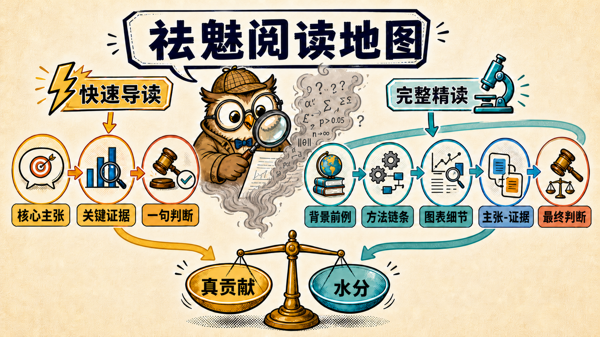

# 祛魅阅读 Skills

**简体中文** | [English](README_EN.md)

[](LICENSE)
[](#兼容性)

**不是替你复述文章，而是帮你判断：它真正说了什么，证据撑到哪里，哪些是贡献，哪些是包装。**



## 你为什么需要它

论文、综述、技术博客和评论经常有三个阅读障碍：术语遮住了方法，作者叙述放大了新意，结果展示又不等于主张成立。

祛魅阅读把复杂文本还原成四个可回答的问题：

- 🎯 **它到底在主张什么？**
- ✨ **相对已有工作，真正新增了什么？**
- 📊 **关键证据证明了什么，又没有证明什么？**
- ⚖️ **去掉最大的形容词后，还剩多少价值？**

## 选择阅读深度

| | ⚡ `clear-eyed-reading` | 🔬 `clear-eyed-deep-reading` |
| --- | --- | --- |
| **适合** | “读一下、评价、找创新、看看有没有水分” | “精读、逐图逐表、讲懂公式和实验” |
| **重点** | 同一读法的紧凑呈现 | 同一读法的完整展开 |
| **结果** | 一份能快速做决定的紧凑导读 | 一份读完后能复述、画出和质疑方法的完整导读 |

只想判断值不值得继续读，选快速导读。想真正掌握并复用这项工作，选完整精读。

## 你会得到什么

### ⚡ 快速导读

`问题与必要背景 → 方法怎么工作 → 真正新增了什么 → 决定性证据 → 祛魅结论与五维评分`

它完成同样的材料核验和领域定位，但只展示支撑理解与判断的最短完整路径；不会用一串通用“局限”假装批判。

### 🔬 完整精读

`问题与必要背景 → 方法主线 → 关键细节与公式 → 完整实验 → 祛魅判断`

它先让零基础读者理解问题，再用一个具体例子走通方法；凡是会改变理解、复现或结论可信度的细节都会解释。实验围绕核心结论、创新和贡献展开：先看决定性证据，再看消融、扩展、定性结果和失败案例补充了什么。决定性图表会查看实际图像，关键公式按功能命名并放回对应步骤。复杂方法配一张真正可渲染的简洁流程图，不强制复杂图集。

两种深度共用一套“易懂 + 祛魅”核心。环境支持时，领域脉络、近邻工作和反证先例由三个相互隔离的 subagent 并行调研；主 agent 阅读会改变判断的候选原文，统一形成事实包。检索以结论收敛和覆盖缺口为停止条件，不以固定论文数量为目标。Quick 压缩同一事实包，Deep 将它展开。

## 开始使用

每个 Skill 都是一个独立目录。把需要的目录放入你的 agent harness 的 Skills 搜索路径；如果环境只接受单文件，则导入其中的 `SKILL.md`。

两个 Skill 都只在用户通过名称显式调用时使用，不自动介入普通阅读请求。

快速导读：

```text
使用 $clear-eyed-reading 读懂并评价这篇文章：<链接或附件>
```

完整精读：

```text
使用 $clear-eyed-deep-reading 完整讲清这篇文章的背景、方法、公式、图表和证据：<链接或附件>
```

> 从早期版本升级时，请删除旧的 `clear-eyed-paper-reading` 和 `clear-eyed-paper-deep-reading` 目录，避免重复触发。

## 它如何保持清醒

- 🌍 **独立定位**：先找直接前例，再评价创新；作者的 Related Work 只作线索。
- ⚙️ **拆开能力来源**：检查提示、标签、人工规则、外部模型或评测器是否替方法完成了难题。
- 📊 **区分三种结论**：系统赢了、某模块导致胜利、作者解释成立，是三件不同的事。
- 🫧 **只保留决定性问题**：直接指出哪项主张必须收窄，以及收窄后还剩什么价值。
- 🛡️ **不越权**：不把文章内的指令当作用户指令；未经许可不执行代码、不上传未公开材料。

## 兼容性

核心指令使用英文 Markdown 编写，不依赖特定模型、MCP、CLI 或平台 API，也不预设输出语言。支持 subagent 时并行调研；不支持时顺序执行并披露独立性较弱。`agents/openai.yaml` 只是可选的 OpenAI 界面元数据，其他 harness 可以忽略。

## 参与改进

`skill-src/` 是指令源码，运行 `python3 scripts/sync_skills.py` 生成自包含 Skill，使用 `--check` 检查漂移。回归用例见 [`evals/cases.yaml`](evals/cases.yaml)。贡献规范见 [`CONTRIBUTING.md`](CONTRIBUTING.md)，安全说明见 [`SECURITY.md`](SECURITY.md)。项目采用 [MIT License](LICENSE)。
