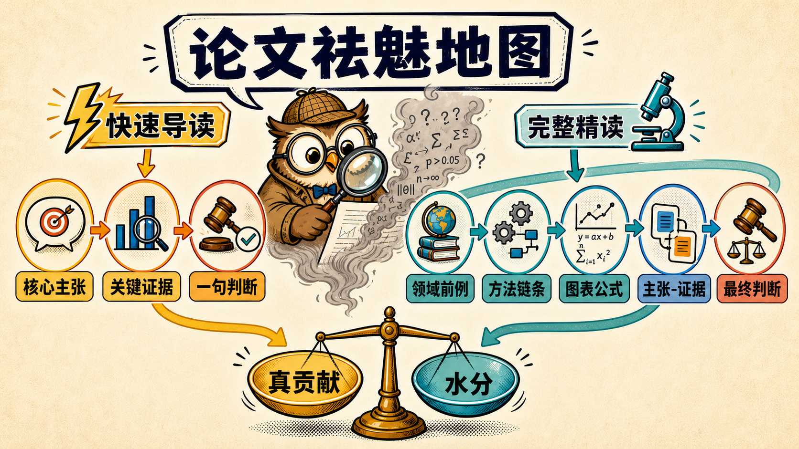

# Paper Demystifier Skills

**简体中文** | [English](README_EN.md)

[](LICENSE)
[](#-harness-与语言)

越过术语看本质：**把工作放回领域，拆开方法机关，核对决定性证据，分清真贡献与水分。**



> 当前版本：`v0.1`。两个 Skill 均已通过结构校验，并持续覆盖不同学科、文章类型、语言和 agent 环境。

## 🧭 选择 Skill

| 你的需求 | Skill | 默认产出 |
| --- | --- | --- |
| ⚡“快速读懂、评价创新、看看有没有水分” | [`clear-eyed-paper-reading`](skills/clear-eyed-paper-reading/SKILL.md) | 紧凑导读、决定性证据、五维简评与一句总评 |
| 🔬“逐节精读、讲懂全部图表、公式和实验” | [`clear-eyed-paper-deep-reading`](skills/clear-eyed-paper-deep-reading/SKILL.md) | 领域地图、可运行的方法模型、完整证据链与最终判断 |

一句话选择：**想判断一篇工作是否值得关注，用快速导读；想读到能够复述、借用或质疑它，用完整精读。**

两个 Skill 刻意分开：简单请求不会被完整流程拖长，真正的精读也不会退化成摘要。

## 🌐 Harness 与语言

- **核心不绑定 harness**：全部关键行为都在纯 Markdown `SKILL.md` 中，不依赖特定模型、MCP、CLI、文件路径或平台 API。
- **英文指令，不预设输出语言**：Skill 指令使用英文以减少歧义；输出语言由用户请求、当前对话和宿主模型决定。
- **平台元数据可选**：`agents/openai.yaml` 只提供 OpenAI 产品中的展示信息，其他 harness 可以安全忽略，不影响 Skill 工作。

任何能够加载 Skill 指令的 agent harness 都可以使用核心 Skill。文档读取、网络检索、引用管理等能力由实际运行环境提供。

## ✨ 如何祛魅

两种阅读深度使用同一把尺子：

1. 🌍 **放回领域**：独立寻找直接前例，而不是复述作者的 Related Work。
2. ⚙️ **拆开方法**：还原为普通部件，查清新能力是否来自提示、标签、规则或外部模型。
3. 📊 **核对证据**：区分“系统赢了”“模块导致胜利”“作者解释成立”。
4. ⚖️ **收束判断**：明确哪项主张必须收窄，以及收窄后还剩什么价值。

批判只针对主张、证据和推理，不针对作者。每个强判断都应落回原文、图表、公式或独立核实的领域前例。

## 🚀 安装

每个 Skill 都是独立目录。将所需目录放入目标 harness 的 Skills 搜索路径即可；如果目标只接受单个指令文件，则导入对应的 `SKILL.md`。

以下只是平台示例，不代表运行限制。

### ChatGPT 示例

通过支持个人 Skills 的界面导入所需的 `SKILL.md`：

- [文章祛魅导读](skills/clear-eyed-paper-reading/SKILL.md)
- [文章祛魅精读](skills/clear-eyed-paper-deep-reading/SKILL.md)

### Codex 示例

```bash
cp -R skills/clear-eyed-paper-reading ~/.codex/skills/
cp -R skills/clear-eyed-paper-deep-reading ~/.codex/skills/
```

## 💬 使用

快速导读：

```text
使用 $clear-eyed-paper-reading 读懂并评价这篇论文：<链接或附件>
```

完整精读：

```text
使用 $clear-eyed-paper-deep-reading 讲清这篇论文的背景、方法、公式、全部图表和实验：<链接或附件>
```

提示词可以使用任何语言；Skill 不指定默认输出语言。

## 🗂️ 项目结构

```text
paper-demystifier-skills/
├── assets/
│   ├── paper-demystifier-map.png
│   └── paper-demystifier-map-v2.png
├── skills/
│   ├── clear-eyed-paper-reading/
│   │   ├── SKILL.md
│   │   └── agents/openai.yaml
│   └── clear-eyed-paper-deep-reading/
│       ├── SKILL.md
│       └── agents/openai.yaml
├── evals/cases.yaml
├── README.md
├── README_EN.md
├── CONTRIBUTING.md
└── LICENSE
```

## ✅ 开发与验证

修改时应保持：

- 两个触发 description 互斥，不争抢同一句请求；
- 核心指令保持 harness-neutral，不引入平台依赖；
- Skill 不预设默认输出语言；
- ⚡快速导读保持紧凑，不自动展开逐节精读；
- 🔬完整精读覆盖全部图表、关键公式和相关附录；
- 创新性与意义依赖独立领域定位，而不是作者自评；
- 结论具体、可追溯，不靠通用“局限”制造批判感。

回归用例见 [`evals/cases.yaml`](evals/cases.yaml)。贡献前请阅读 [`CONTRIBUTING.md`](CONTRIBUTING.md)，安全问题见 [`SECURITY.md`](SECURITY.md)。

本项目使用 [MIT License](LICENSE)。

## 🔗 格式参考

- [OpenAI：Build skills](https://developers.openai.com/plugins/build/skills)
- [OpenAI：Skills & Plugins](https://learn.chatgpt.com/docs/skills-and-plugins)
