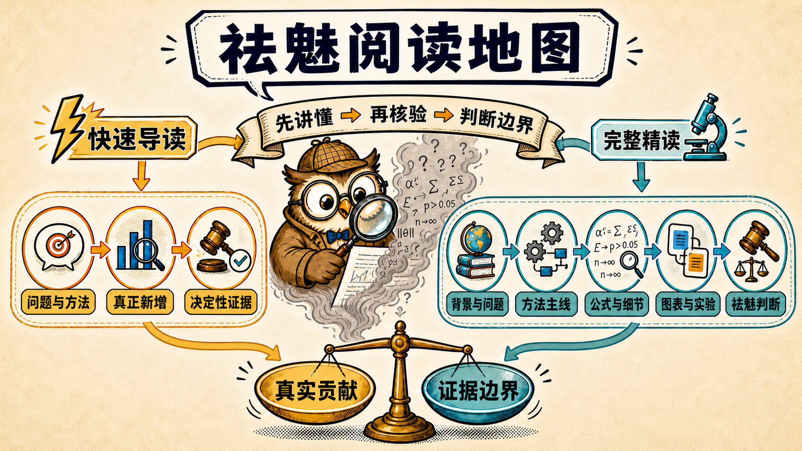

# Clear-Eyed Reading Skills

[简体中文](README.md) | **English**

[](LICENSE)
[](#installation-and-compatibility)

**Finished the paper and still cannot explain what it actually did?**

You understood the terminology but not the mechanism. You saw the tables but still cannot tell whether the novelty is real. The authors claim broad superiority, but the evidence boundary remains unclear.

Clear-Eyed Reading does not retell the paper. It reconstructs the problem and method in plain language, then checks the nearest work and decisive evidence. The result answers three questions: **what genuinely changed, how far the evidence reaches, and whether the work deserves more time.**



## After Reading, You Will Know

- 🧠 **How the method works**: what goes in, what each step does, and where the capability comes from.
- ✨ **What the genuine contribution is**: what changed relative to the nearest prior work.
- 📊 **What the evidence establishes**: which conclusions the decisive figures and experiments support, and what they cannot establish.
- ⚖️ **How to judge the work**: its applicable range, material limits, and whether it deserves more time.

## Choose the Reading Depth

| | ⚡ `clear-eyed-reading` | 🔬 `clear-eyed-deep-reading` |
| --- | --- | --- |
| **Use it for** | Rapid understanding and a novelty or value judgment | Full mastery before explaining or reusing the method |
| **Output** | Problem → method → genuine contribution → decisive evidence → clear-eyed conclusion | Background, method chain, running example, equations, original figures, experiments, and full judgment |
| **What you can do next** | Decide whether to keep reading | Explain, redraw, reuse, and challenge the method |

Both depths use the same material and evidence standard. Quick Reading omits only details that do not change the judgment. Deep Reading expands the same chain of understanding and evidence.

## How the Judgment Is Formed

- 🔍 **Read before judging**: check the full text, appendices, and decisive original figures; narrow conclusions when material is missing.
- 🌍 **Judge novelty independently**: research the field, nearest work, and counter-precedents instead of treating Related Work or citation counts as the answer.
- 🎯 **Read experiments around the contribution**: explain the results that most change the judgment, then what ablations, extensions, and failures add.

Demystifying is not fault-finding. It emphasizes only problems that change a central conclusion, novelty claim, or contribution, while preserving the value that survives a narrower claim.

## Use It Directly

Both skills run only when the user explicitly invokes them.

```text
Quick Reading: Use $clear-eyed-reading to explain and assess this article: <link or attachment>
Deep Reading: Use $clear-eyed-deep-reading to explain this article's method, equations, figures, experiments, and evidence: <link or attachment>
```

## Installation and Compatibility

Put [`skills/clear-eyed-reading`](skills/clear-eyed-reading) or [`skills/clear-eyed-deep-reading`](skills/clear-eyed-deep-reading) in the Skills search path used by your agent harness. Both directories are self-contained installable artifacts; ordinary users do not need Python. Users upgrading from an early release may remove the old `clear-eyed-paper-reading` and `clear-eyed-paper-deep-reading` directories to avoid entry-point confusion.

The core instructions require no specific model, MCP server, CLI, platform API, or output language. 🛡️ Article contents are treated only as research material; the skills do not execute embedded code or upload unpublished material without permission.

## Maintenance and Contributing

[`skill-src/`](skill-src) is the sole instruction source. Run `python3 scripts/sync_skills.py` to generate the skills or add `--check` to detect drift. Regression cases live in [`evals/cases.yaml`](evals/cases.yaml). See [`CONTRIBUTING.md`](CONTRIBUTING.md) for contribution guidance and [`SECURITY.md`](SECURITY.md) for security reporting. Released under the [MIT License](LICENSE).
