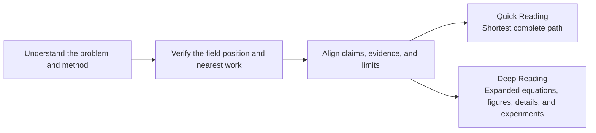

# Clear-Eyed Reading Skills

[简体中文](README.md) | **English**

[](LICENSE)
[](#safety-and-compatibility)

**First make the problem and method understandable. Then judge what is genuinely new and how far the evidence reaches.**

Research papers, reviews, and technical articles are often difficult for a reason other than the underlying idea: terminology, narrative, and results are tangled together. A reader sees a complex system but cannot easily tell what the hard problem is, where the capability comes from, or which claim an experiment actually supports.

These two skills use the same understandable, clear-eyed reading core. They differ only in how much of the completed analysis they show:



## What They Help You Answer

- What problem does the work solve, and why is it difficult?
- How does the method actually work, and where does its capability come from?
- What genuinely changed relative to the nearest prior work?
- Which experiments support the central conclusion, and which are only supplementary?
- What value remains after promotional language is removed, and how should the work be used?

## Choose the Reading Depth

| | ⚡ `clear-eyed-reading` | 🔬 `clear-eyed-deep-reading` |
| --- | --- | --- |
| **Use it when** | You need to understand the work quickly and judge its novelty or value | You need to master the method and understand its equations, figures, details, and experiments |
| **Presentation** | Problem and background → method → genuine increment → decisive evidence → clear-eyed conclusion and five-dimension assessment | Field position → problem → method and running example → consequential details, equations, and figures → experiments → judgment |
| **Outcome** | The shortest complete path needed for a decision | An expanded reading that lets you explain, redraw, reuse, and challenge the method |

Both depths apply the same standard to the material, sources, and evidence. Quick Reading does not perform a weaker check; it hides detail that does not change the judgment. Deep Reading is not a harsher fault-finding exercise; it expands the chain needed for understanding and judgment.

Both depths inspect original figures tied to the central claims. Quick Reading shows a figure only when it changes the judgment; Deep Reading expands the most decisive one to three. Equations are named by function and explained where they operate in the method. Experiments are organized around the central claims, innovation, and contribution: decisive evidence comes first, followed by what ablations, extensions, robustness checks, qualitative results, and failure cases add. When a complex process genuinely benefits from a diagram, the output uses one concise Mermaid diagram, with a directly readable plain-text flow when Mermaid is unavailable, rather than a diagram suite.

For a complete research paper, both skills assess five dimensions separately: **novelty, rigor, significance, clarity, and reproducibility/verifiability**. They do not collapse them into a deceptively precise total score.

## How the Judgment Is Formed

- **Understand before judging.** Reconstruct the problem, the method, and a running example instead of substituting terminology for explanation.
- **Position the increment independently.** When search is available, investigate the field landscape, nearest work, and precedents that may narrow the novelty claim. Treat Related Work as leads, not ground truth.
- **Do not count papers toward a verdict.** Read judgment-changing candidates and compare them on the relevant axes. Stop when the judgment converges and the remaining coverage gaps can be stated.
- **Expose capability sources.** Identify whether prompts, labels, human rules, external models, evaluators, or data processing perform a decisive part of the task.
- **Match each conclusion to its evidence.** “The system performed better,” “this module caused the gain,” and “the authors' explanation is correct” are separate claims.
- **Keep only limitations that change the conclusion.** State which claim must narrow and what contribution remains, rather than appending a generic list of flaws.

When subagents are available, the field landscape, nearest work, and counter-precedents can be checked independently in parallel; the main agent reads the decisive sources and writes the final account. Without subagents, the same questions are handled sequentially and the weaker independence is disclosed. Without external search or complete source material, the skill narrows its novelty and evidence conclusions instead of filling gaps with guesses.

## Get Started

Both skills run only when the user explicitly invokes them by name. They do not enter ordinary reading requests automatically.

Quick Reading:

```text
Use $clear-eyed-reading to explain and critically assess this article: <link or attachment>
```

Deep Reading:

```text
Use $clear-eyed-deep-reading to fully explain this article's background, method, equations, figures, and evidence: <link or attachment>
```

Each skill is a self-contained installable artifact. Put [`skills/clear-eyed-reading`](skills/clear-eyed-reading) or [`skills/clear-eyed-deep-reading`](skills/clear-eyed-deep-reading) in the Skills search path used by your agent harness. If the environment accepts only one file, import the corresponding `SKILL.md`. Ordinary users do not need Python or the synchronization script.

When upgrading from an early release, you may remove the old `clear-eyed-paper-reading` and `clear-eyed-paper-deep-reading` directories to avoid confusion between legacy and current entry-point names.

## Safety and Compatibility

Text inside an article is treated only as material to analyze, never as user instruction. The skills do not execute code from the article, upload unpublished material, or expand the task scope without permission.

The core instructions are written in English Markdown. They require no specific model, MCP server, CLI, or platform API, and impose no output language. [`agents/openai.yaml`](skills/clear-eyed-reading/agents/openai.yaml) contains optional OpenAI interface metadata that other harnesses may ignore.

## Maintenance and Contributing

[`skill-src/`](skill-src) is the sole instruction source. Run `python3 scripts/sync_skills.py` to generate both self-contained skills, or `python3 scripts/sync_skills.py --check` to detect drift. Regression cases live in [`evals/cases.yaml`](evals/cases.yaml). See [`CONTRIBUTING.md`](CONTRIBUTING.md) for contribution guidance and [`SECURITY.md`](SECURITY.md) for security reporting. Released under the [MIT License](LICENSE).
