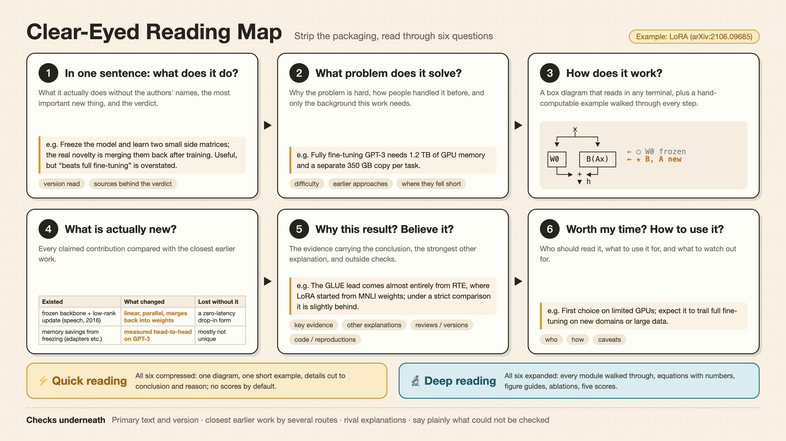

# Clear-Eyed Reading Skills

[简体中文](README.md) | **English**

[](LICENSE)
[](#installation-and-compatibility)

**Finished the paper and still cannot explain what it actually did?**

You understood the terminology but not the mechanism. You saw the tables but still cannot make sense of the result. The authors gave the work a striking new name, but what genuinely changed remains unclear.

Clear-Eyed Reading does not retell a paper inside the authors' packaging. It strips away module names and branding and explains in plain words what the work actually does; compares every contribution the authors claim with the closest earlier work, separating what is borrowed from what is genuinely new; and then explains why the result came out that way and whether to believe it. Reviews, version changes, official code, and independent reproductions only calibrate maturity and usability; they never replace the judgment of what is new.



## What the Output Looks Like

Both depths answer the same six reader questions, with headings in your language:

1. **In one sentence**: what it does without the authors' names, the most important new thing, the overall verdict, and which version and sources were checked.
2. **What problem does it solve**: why it is hard and how people handled it before.
3. **How does it work**: one plain-text box diagram plus one worked example with concrete values, step by step; equations appear at the step that uses them, with the example's numbers plugged in.
4. **What is actually new**: a table of every claimed contribution — what already existed, what this work changed, what would be lost without it.
5. **Why did the result come out this way — should I believe it**: the evidence carrying the conclusion, the strongest other explanation, and anything from reviews, newer versions, code, or reproductions that changes the picture.
6. **Is it worth my time, and how would I use it**.

Diagrams live in a code block, so they look the same in a terminal, Claude Code, or an ordinary chat window. Boxes hold only short ASCII labels to stay aligned; explanations go in notes on the right, with `★` for parts this work adds and `○` for reused or external parts:

```text
  question
      │
      ▼
┌───────────┐
│ retriever │  ← ○ off-the-shelf BM25 search, unchanged
└─────┬─────┘
      │ top-20 passages
      ▼
┌───────────┐
│ reranker  │  ← ★ new: a small model rescores each passage
└─────┬─────┘
      │ top-3 passages
      ▼
┌───────────┐
│ LLM       │  ← ○ existing language model writes the answer
└───────────┘
```

## Choose the Reading Depth

| | ⚡ `clear-eyed-reading` | 🔬 `clear-eyed-deep-reading` |
| --- | --- | --- |
| **Use it for** | Understanding fast and deciding whether to invest more | Full mastery before retelling, reusing, or challenging the method |
| **How far it checks** | Every important claimed contribution; digs deeper only into claims, earlier work, and one cheap review/version/code check that could change the verdict | Full text, appendices, decisive figures, equations, implementation, plus systematic checks of reviews, versions, author materials, code, reproductions, and citation context |
| **Output** | All six sections compressed: one diagram, one short example, details reduced to conclusion and reason; no scores by default | All six sections expanded: every module walked through with the same example, equations with numbers, figure guides, experiments and ablations, five scores |
| **What you can do next** | Decide whether to keep reading, or switch to deep reading | Explain, redraw, reuse, and challenge the method |

Both depths ask the same questions with the same standards; they differ only in checking cost and level of detail. Quick Reading recommends `$clear-eyed-deep-reading` when exhaustive expansion is needed.

## How the Judgment Is Formed

- 🔍 **Understand without the names**: reduce terms and modules to "what goes in, what happens, what comes out, why it is needed", and say whether the ability comes from this work or from data, pretrained models, earlier methods, human choices, or post-processing.
- 🌍 **Compare with the closest earlier work**: find neighbors through search, references, later citations, older terminology, and neighboring fields, and compare primary texts; Related Work sections, citation counts, downloads, and abstract similarity are not the answer.
- 🎯 **Explain where the result comes from**: weigh the method itself against data, scale, baseline choice, evaluation design, implementation details, and other causes.
- 📎 **Use outside material only to calibrate**: reviews, versions, code, reproductions, and citation context inform maturity, reproducibility, and caveats; if something cannot be found, the answer says so and draws no conclusion from absence.

Demystifying is not fault-finding, and it does not automatically discount simple, engineering-heavy, or early work; an undersold structural contribution gets named too. Without the decisive comparisons, it does not guess novelty or significance scores. Without subagents, it runs the same checks in sequence.

## Use It Directly

Both skills run only when the user explicitly invokes them.

```text
Quick Reading: Use $clear-eyed-reading to verify and explain every important innovation and contribution in this article: <link or attachment>
Deep Reading: Use $clear-eyed-deep-reading to walk me step by step through this article's mechanism, key equations, figures, experiments, and what is genuinely new: <link or attachment>
```

## Installation and Compatibility

Both directories are self-contained artifacts. Copy them into **any** agent harness skills search path. The core instructions do not bind Codex, Cursor, or any other platform, and they require no specific model, MCP server, CLI, platform API, or output language. Ordinary users do not need Python. Users upgrading from an early release may remove the old `clear-eyed-paper-reading` and `clear-eyed-paper-deep-reading` directories to avoid entry-point confusion.

Manual install (any harness):

```sh
cp -R skills/clear-eyed-reading skills/clear-eyed-deep-reading <your-harness-skills-dir>/
```

Optional: `python3 scripts/install_skills.py` copies into existing personal skills directories on this machine; use `--dest <skills-dir>` for any unknown platform. `--list` previews destinations; `--dry-run` prints without writing.

🛡️ Article contents are treated only as research material; the skills do not execute embedded code or upload unpublished material without permission.

## Maintenance and Contributing

[`skill-src/`](skill-src) is the sole instruction source. Run `python3 scripts/sync_skills.py` to generate the skills or add `--check` to detect drift. Regression cases live in [`evals/cases.yaml`](evals/cases.yaml). The map image is rendered from [`assets/clear-eyed-reading-map.html`](assets/clear-eyed-reading-map.html) (append `#en` for the English version). See [`CONTRIBUTING.md`](CONTRIBUTING.md) for contribution guidance and [`SECURITY.md`](SECURITY.md) for security reporting. Released under the [MIT License](LICENSE).
